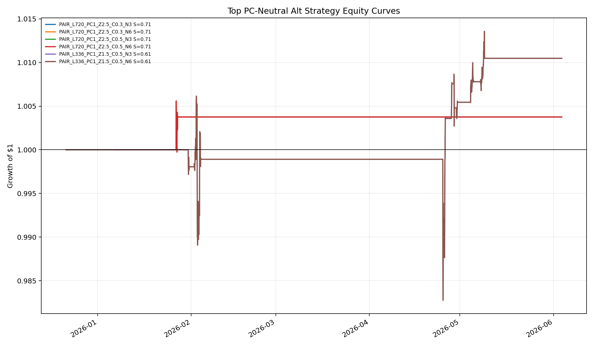
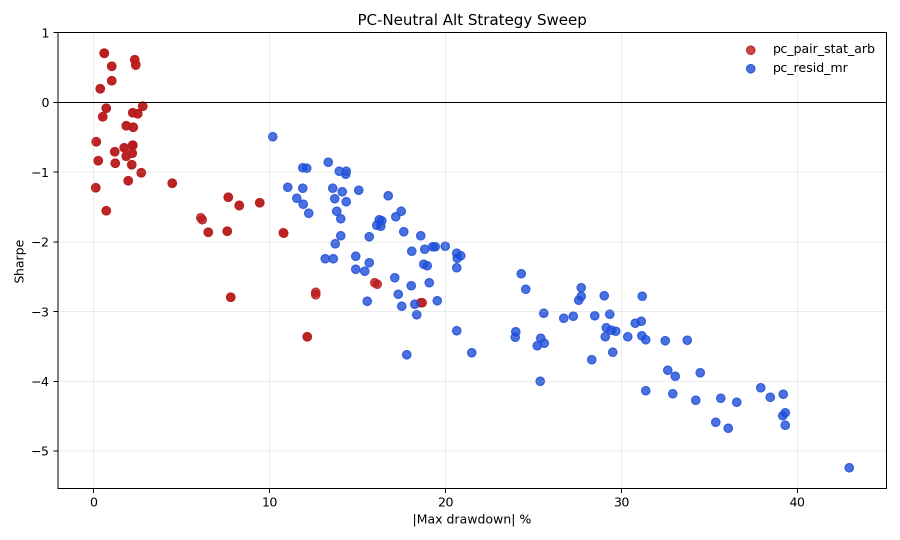
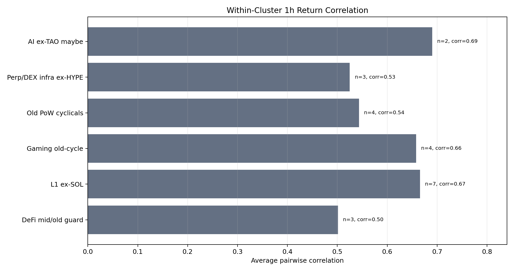

# PC-Neutral Alt Mean Reversion / Stat-Arb Sweep

Window: `2025-12-07 13:00:00+00:00` -> `2026-06-03 18:00:00+00:00`.

Funding is omitted in this first pass because the broad Hyperliquid funding refresh hit 429 rate limits.

Available requested alts: `COMP, SNX, CRV, NEAR, DOT, ATOM, INJ, SUI, APT, SEI, AXS, SAND, GALA, IMX, LTC, BCH, ETC, ZEC, GMX, DYDX, RUNE, RENDER, FET`
Missing on Hyperliquid: `BAL, 1INCH, CVX, MANA, RON, GNS, AKT, GRT, ASI`

## Top Rows by Sharpe

| Rank | Name | Family | Return | Sharpe | MDD | Calmar | Gross | Active | Fees |
|---:|---|---|---:|---:|---:|---:|---:|---:|---:|
| 1 | `PAIR_L720_PC1_Z2.5_C0.3_N3` | pc_pair_stat_arb | 0.38% | 0.71 | -0.58% | 1.59 | 0.00 | 0.3% | 0.02% |
| 2 | `PAIR_L720_PC1_Z2.5_C0.3_N6` | pc_pair_stat_arb | 0.38% | 0.71 | -0.58% | 1.59 | 0.00 | 0.3% | 0.02% |
| 3 | `PAIR_L720_PC1_Z2.5_C0.5_N3` | pc_pair_stat_arb | 0.38% | 0.71 | -0.58% | 1.59 | 0.00 | 0.3% | 0.02% |
| 4 | `PAIR_L720_PC1_Z2.5_C0.5_N6` | pc_pair_stat_arb | 0.38% | 0.71 | -0.58% | 1.59 | 0.00 | 0.3% | 0.02% |
| 5 | `PAIR_L336_PC1_Z1.5_C0.5_N3` | pc_pair_stat_arb | 1.05% | 0.61 | -2.32% | 1.01 | 0.01 | 3.8% | 0.26% |
| 6 | `PAIR_L336_PC1_Z1.5_C0.5_N6` | pc_pair_stat_arb | 1.05% | 0.61 | -2.32% | 1.01 | 0.01 | 3.8% | 0.26% |
| 7 | `PAIR_L720_PC2_Z2_C0.1_N3` | pc_pair_stat_arb | 1.15% | 0.55 | -2.38% | 1.20 | 0.06 | 13.9% | 1.64% |
| 8 | `PAIR_L720_PC2_Z2_C0.1_N6` | pc_pair_stat_arb | 1.13% | 0.54 | -2.38% | 1.17 | 0.06 | 13.9% | 1.65% |
| 9 | `PAIR_L336_PC3_Z1.5_C0.3_N3` | pc_pair_stat_arb | 0.27% | 0.52 | -1.02% | 0.60 | 0.01 | 0.9% | 0.21% |
| 10 | `PAIR_L336_PC3_Z1.5_C0.3_N6` | pc_pair_stat_arb | 0.27% | 0.52 | -1.02% | 0.60 | 0.01 | 0.9% | 0.21% |
| 11 | `PAIR_L336_PC1_Z2.5_C0.3_N3` | pc_pair_stat_arb | 0.31% | 0.31 | -1.00% | 0.68 | 0.00 | 0.4% | 0.05% |
| 12 | `PAIR_L336_PC1_Z2.5_C0.3_N6` | pc_pair_stat_arb | 0.31% | 0.31 | -1.00% | 0.68 | 0.00 | 0.4% | 0.05% |

## Charts

## Method

- Factor set: BTC, ETH, and all available requested alts.
- Trade set: requested alts only.
- PCA is fit walk-forward on standardized 1h returns.
- PC residual MR trades extreme residual z-scores against the move.
- Pair stat-arb trades within user-specified clusters after residualizing to PCs.
- Target weights are projected to be neutral to the fitted PCs, then capped at 15% per token and 100% gross.
- Rebalance cadence: 4h. Fee: 0.035% per unit turnover.
