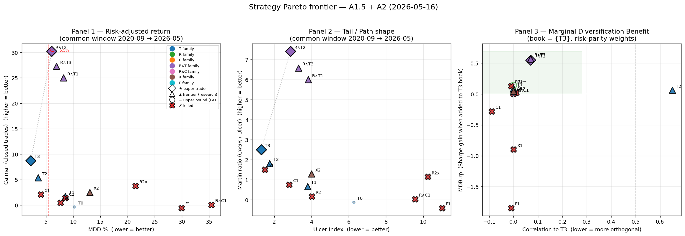

# Research

Multi-strategy backtest harness for crypto perpetual futures, built on [Freqtrade](https://www.freqtrade.io/en/stable/). Targets Hyperliquid for live trading and uses Binance perp history for cross-cycle validation.

**Snapshot: 2026-05-16**

---

## Paper

**A Six-Layer Evaluation Stack and a Portfolio-Aware Kill Criterion** — local [PDF](../../publications/evaluation-framework/paper/main.pdf) · single-column LaTeX, 14 pages.

Contribution is the methodology, not the strategies. The strategies below are the worked example.

The stack: (L1) returns, (L2) risk-adjusted return, (L3) sample-size awareness via Probabilistic Sharpe, (L4) multiple-testing deflation via DSR, (L5) tail and path shape, (L6) portfolio diversification via correlation and Marginal Diversification Benefit. A pre-registered kill criterion (5.5% bear MDD) sits on top of the stack, with continuous shrinkage along the slope-sizing axis as the load-bearing finding.

## Freqtrade specifics

Hyperliquid uses USDC and futures pairs such as `BTC/USDC:USDC`. Market data is
stored as Feather. The canonical baseline is `LongOnlyStrategy` on 5m BTC/USDC:

```shell
freqtrade backtesting \
  --datadir data --strategy-path strategies \
  -c configs/config.json \
  --data-format-ohlcv feather \
  -s LongOnlyStrategy -i 5m \
  -p BTC/USDC:USDC \
  --eps --max-open-trades 1
```

---

## The worked example

Five strategies. One Pareto frontier. No single best.



Left panel: bull-cycle return vs bear-cycle drawdown. The dashed line is the **Pareto frontier** — every strategy on it is non-dominated. The pink zone right of 5.5% is the kill-criterion territory ([decision 004](analysis/reports/2026-05-10-decision-004-kill-criteria-sma-regime-180.md)).

Right panel: Calmar vs trade density. Same five strategies.

There is no "best" strategy on either chart. There is a **frontier**, and the right choice depends on which regime you think is coming AND whether you intend to paper-trade under the existing kill rule.

---

## The five strategies

Each is regime-conditional in a different way. Same code, dramatically different verdicts between bull and bear regimes:

| Strategy | Bull return | Bull MDD | Bear return | Bear MDD | Kill rule (≤5.5%)? |
|---|---:|---:|---:|---:|:---:|
| **SmaRegime180** (BTC) | +20.0% | 1.83% | +1.3% | 1.74% | ✓ |
| **HmmSmaSlopeV2** (6 coins) | +33.4% | 5.89% | −1.6% | 4.44% | ✓ |
| **HmmSmaSlopeV3** (6 coins) | +39.6% | 5.77% | −2.1% | 5.72% | ✗ (by 0.22pp) |
| **HmmSmaSlope V1** (6 coins) | +50.5% | 5.15% | −4.0% | 8.65% | ✗ |
| **HmmRegime4Rolling-multi** (6 coins) | +65.4% | 5.69% | −5.6% | 14.70% | ✗ |

Each row is a single strategy's *shape*, not its *score*. The shape changes which problem the strategy solves:

- **SmaRegime180** preserves capital through bears at the cost of low signal density.
- **HmmRegime4Rolling-multi** captures bulls aggressively at the cost of structural bear exposure.
- The three middle conjunctions trace a continuous tradeoff between the two endpoints, parameterised by the slope-sizing exponent (binary → sqrt → linear).

Full per-strategy detail is in [analysis/reports/](analysis/reports/). The cross-cutting verdicts are in [../../wiki/learnings-archive.md](../../wiki/learnings-archive.md). The principled writeup of the framework above is the paper PDF linked at the top of this README.

---

## Three things this project has confirmed

1. **Backtests on the wrong regime are worse than no backtest.** Three strategies (FundingCarry, HmmCarry, HmmRegime4Rolling-multi) were initially labelled "ruled out" or "structurally weak" based on a 6-month bear-window run. A 24-month bull-window run on the same code flipped them all dramatically: FundingCarry win-rate 10.6% → 52.4%, HmmCarry total return −19.6% → +25.8%, HMM-multi −5.6% → +65.4%. Single-regime backtests can be qualitatively wrong about whether a signal exists.

2. **Single-metric ranking is noise-dominated.** Ranking the five strategies by Calmar gives a different winner than ranking by Sharpe, profit factor, or win rate. The Pareto frame keeps the multi-dimensional structure visible instead of collapsing it.

3. **No strategy currently passes the deflated-Sharpe gate.** A López de Prado DSR analysis across all nine backtest archives finds every strategy at DSR < 0.01 — undistinguishable from noise at 95% confidence. The Pareto frame remains valid as a *risk-preference* tool, but cannot yet support a "this has signal" claim. See [`analysis/reports/2026-05-10-dsr-analysis.md`](analysis/reports/2026-05-10-dsr-analysis.md).

---

## Reproduce

Setup, environment, and full backtest commands: [../../wiki/_index.md → Setup](../../wiki/_index.md#setup-first-run-on-this-machine).

Key artefact regeneration:

```shell
# Update the Pareto chart after any new backtest run
./.venv/bin/python analysis/generate_pareto_chart.py

# Re-run the DSR analysis with current archives
./.venv/bin/python analysis/dsr_analysis.py
```

The chart and DSR tables read directly from `analysis/backtests/*.zip`. Freqtrade is not vendored here; recreate `.venv/` from the official Freqtrade distribution when reproducing the commands. Adding a new strategy means: (1) drop a new entry into `STRATEGIES` in `generate_pareto_chart.py`, (2) add the archive to `RUNS` in `dsr_analysis.py`, (3) regenerate.

---

## Project structure

| Path | What |
|---|---|
| `strategies/` | Strategy files |
| `data/` | OHLCV (feather) and funding-rate (parquet) caches |
| `analysis/backtests/` | Backtest archives (zipped JSON + equity feathers) |
| `scripts/` | Data downloads, cointegration preflight, and baseline entrypoint |
| `analysis/` | Experiment-specific evaluation drivers and reporting |
| `../../wiki/` | Cross-cutting documentation and shared knowledge |
| `analysis/reports/` | Experiment-specific result cards, decisions, tables, and generated assets |
| `.venv/` | Local, ignored Freqtrade environment created on demand |

The dated files in `analysis/reports/` are the canonical experiment record.
The root wiki holds only cross-cutting knowledge. This README is a snapshot.

## Later portfolio research

June portfolio experiments added a signed mean-variance candidate that cleared
its short-window research gate (+122.61% return, 3.86 Sharpe, 35.97 Calmar,
17.23% MDD). A PC-neutral alternative was sparse and failed after fees. Keep
the signed result in research until it survives cross-cycle validation; it was
not promoted to live capital. Code is in `analysis/` and `strategies/`, results
are in `analysis/reports/`, and the local monitor is in
`../mean-variance-paper/`.

---

## Deprecated

The old bar-chart leaderboard (`analysis/reports/leaderboard.png`) is superseded by
the Pareto chart above. Its generator was removed during cleanup; the rendered
image is retained only as historical output.
